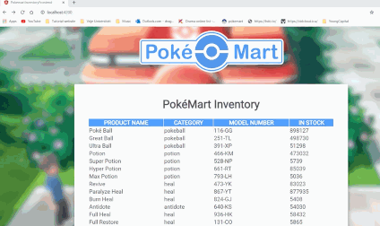

# PokeMart
All kinds of miniprojects about PokeMart

<h2>Poke Mart Inventory</h2>
 

<ul>
  <li> Description: Simple list of current inventory in Poke Mart shop. You can add a new item to the list </li>
  <li> Backend: SQL database, Maven, Hibernate and JPA, Spring Boot </li>
  <li> Frontend: Angular </li>
  <li> Future plans? Add login screen and authorization </li>
</ul>
